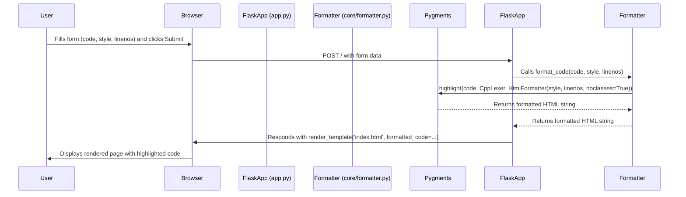

# Diseño Técnico: Opciones de Resaltado

## 1. Módulos y Firmas de Funciones

### `core/formatter.py`

```python
from pygments import highlight
from pygments.lexers import CppLexer
from pygments.formatters import HtmlFormatter

def format_code(code_string: str, style: str, linenos: bool) -> str:
    """
    Formatea una cadena de código a HTML con estilos en línea.
    """
    lexer = CppLexer()
    formatter = HtmlFormatter(
        style=style,
        linenos='inline' if linenos else False,
        noclasses=True
    )
    return highlight(code_string, lexer, formatter)
```

### `app.py`

```python
from flask import Flask, render_template, request
from core.formatter import format_code
from pygments.styles import get_all_styles
import os

app = Flask(__name__)

ALLOWED_EXTENSIONS = {'cpp', 'h'}

def allowed_file(filename: str) -> bool:
    """
    Verifica si la extensión de un archivo es válida.
    """
    return '.' in filename and \
           filename.rsplit('.', 1)[1].lower() in ALLOWED_EXTENSIONS

@app.route('/', methods=['GET', 'POST'])
def index():
    error = None
    formatted_code = None
    styles = list(get_all_styles())
    
    if request.method == 'POST':
        code = request.form.get('code')
        file = request.files.get('file')
        style = request.form.get('style', 'default')
        linenos = request.form.get('linenos') == 'True'
        
        code_to_format = ''
        if file and file.filename:
            if allowed_file(file.filename):
                code_to_format = file.read().decode('utf-8')
            else:
                error = "Error: Por favor, suba un archivo .cpp o .h"
        elif code:
            code_to_format = code
        
        if code_to_format and not error:
            formatted_code = format_code(code_to_format, style, linenos)
            
    return render_template('index.html', formatted_code=formatted_code, error=error, styles=styles)

if __name__ == '__main__':
    app.run(debug=True)
```

## 2. Estructura HTML

### `templates/index.html`

```html
<!DOCTYPE html>
<html lang="es">
<head>
    <meta charset="UTF-8">
    <title>Formateador de Código C++</title>
    <style>
        body { font-family: sans-serif; margin: 2em; }
        .error { color: red; }
    </style>
</head>
<body>
    <h1>Formateador de Código C++</h1>
    
        <p class="error">{{ error }}</p>
    
    <form method="POST" enctype="multipart/form-data">
        <div>
            <label for="style">Estilo:</label>
            <select id="style" name="style">
                
                    <option value="{{ style }}">{{ style }}</option>
                
            </select>
        </div>
        <br>
        <div>
            <label for="linenos">Mostrar números de línea:</label>
            <input type="checkbox" id="linenos" name="linenos" value="True">
        </div>
        <hr>
        <div>
            <label for="file">Subir archivo .cpp o .h:</label>
            <input type="file" id="file" name="file" accept=".cpp,.h">
        </div>
        <hr>
        <div>
            <label for="code">O pegar código aquí:</label><br>
            <textarea id="code" name="code" rows="15" cols="80"></textarea>
        </div>
        <br>
        <button type="submit">Formatear</button>
    </form>
    
    
        <h2>Código Formateado:</h2>
        {{ formatted_code|safe }}
    
</body>
</html>
```

## 3. Diagrama de Secuencia



## 4. Archivo de Dependencias (`requirements.txt`)

No se requieren cambios.

```
